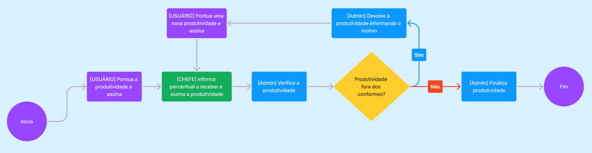

# CPROD - Sistema de Controle de Produtividade

### Descrição

O CPROD - Sistema de Controle de Produtividade é uma ferramenta voltada para o gerenciamento e controle de atividades e pontuações de produtividade em ambientes públicos. Com o CPROD, é possível cadastrar Mapas de Produtividade, onde o usuário associa seu cargo às atividades desempenhadas, atribuindo descrições e pesos a cada tarefa.

O sistema também realiza o cadastro de setores e usuários, vinculando automaticamente os usuários a seus respectivos setores e cargos. O chefe de cada setor é responsável por assinar as produtividades de seus subordinados e definir o valor à receber, enquanto sua própria produtividade é assinada por ele e pelo chefe do setor superior.

### 💻 Tecnologias

- C#
- .NET 8
- ASP.NET Web API
- Entity Framework Core
- Fluent Validation
- TiaIdentity
- Blazor
- MudBlazor
- SQL Server

### 🗂️ Estrutura do Projeto

O projeta utiliza dos princípios e práticas do Domain-Driven Design(DDD) de uma maneira melhorada, modelando o software com base no domínio do problema e adicionando duas camadas extras que são as camadas de **Exceção** e **Comunicação**.

#### Projeto de API

- **Endpoints:** Define os pontos de entrada da aplicação, onde as requisições externas são recebidas e processadas, direcionando-as para os casos de uso adequados.

#### Projeto de Aplicação

- **Regras de Negócio e Validações:** Contém toda a lógica de negócio e as validações específicas da aplicação.
- **Casos de Uso:** Representa as operações centrais da aplicação, organizando as regras e passos necessários para realizar cada funcionalidade principal.

#### Projeto de Comunicação

- **Classes de Request e Response:** Contém as classes que definem a estrutura de requisições e respostas, garantindo que os dados enviados e recebidos estejam no formato correto para a API.

#### Projeto de Exceção

- **Exceções Customizadas:** Define exceções específicas para o projeto, permitindo o tratamento de erros de maneira controlada e personalizada.

#### Projeto de Domínio

- **Interfaces e Contratos:** Define os contratos e interfaces que descrevem as operações essenciais do domínio, servindo como uma ponte entre as diferentes camadas.
- **Entidades:** Representa os objetos de domínio fundamentais, com suas propriedades e comportamentos específicos, encapsulando as regras de negócio relacionadas.

#### Projeto de Infraestrutura

- **Serviços Externos e Persistência:** Contém as implementações para acesso a serviços externos, como bancos de dados, APIs de terceiros, envio de e-mails e upload de arquivos.

#### Projeto Web

- **Interface de Interação com o Usuário:** Define toda a estrutura de interface e os elementos de front-end que permitem a interação com o usuário final.
- **Handlers para Consumo da API:** Configura os manipuladores necessários para consumir os endpoints da API, integrando a lógica de back-end com a interface de front-end.


### 🔀 Fluxograma da Produtividade

O fluxo de produtividade é simples: o usuário acessa o sistema, seleciona a opção de pontuar produtividade, insere o período e pontua as atividades já associadas ao seu cargo. Após assinar, a produtividade é enviada para o chefe, que informa o percentual à ser recebido pelo usuário e depois assina. Em seguida, a produtividade vai para o Recursos Humanos (Admin), que valida ou devolve para correção, encerrando o processo com a finalização da produtividade validada.



O CPROD facilita o gerenciamento de produtividades com um fluxo claro e eficiente, garantindo a transparência e controle das atividades realizadas por cada usuário.

### 🚀 Rodando o Projeto

#### Pré-requisitos

**Sistema Operacional compatível**

- **Windows:**
  - Windows 10 (versão 1607 ou mais recente) ou Windows Server 2016/2019/2022.
- **Linux:**
  - Suporte para várias distribuições, incluindo Ubuntu 18.04 ou superior, Debian 10+, Fedora, RHEL 8+, entre outras.
- **macOS:**
  - macOS 11.0 (Big Sur) ou mais recente.

**SDK instalado**

- [.NET 8.0 SDK](https://download.visualstudio.microsoft.com/download/pr/6224f00f-08da-4e7f-85b1-00d42c2bb3d3/b775de636b91e023574a0bbc291f705a/dotnet-sdk-8.0.403-win-x64.exe)

**Dependências Adicionais para Linux**

- Para distribuições Linux, você pode precisar instalar algumas dependências nativas, como libssl, libicu, e zlib. Essas bibliotecas variam entre distribuições, então consulte a [documentação oficial do .NET](https://learn.microsoft.com/pt-br/dotnet/core/install/linux) para detalhes específicos.

**Banco de Dados SQL Server instalado**

- [SQL Server](https://www.microsoft.com/pt-br/sql-server/sql-server-2022)

#### 🔧 Clonando o repositório do projeto e preparando o sistema

Primeiro, vá para o diretório onde deseja clonar o repositório do projeto, abra o **prompt** e use o comando:

```shell
git clone https://github.com/aledevx/SistemaDeProdutividade.git
```

Após clonar o repositório, entre no diretório do projeto:

```shell
cd SistemaDeProdutividade
```

Restaure os Pacotes com o comando dotnet restore, o comando dotnet restore baixa todas as dependências e pacotes necessários para o projeto:

```shell
dotnet restore
```

Utilizando o Explorador de Arquivos do seu sistema operacional, abra o arquivo **appsettings.json** dentro da pasta **SistemaDeProdutividade.API** e adicione a sua **conection string** referente ao seu banco de dados, exemplo:

```json
  "ConnectionStrings": {
    "DefaultConnection": "Server=SeuEnderecoDB;Database=ExemploDB;User Id=SeuUsuarioDB;Password=SuaSenhaDB;TrustServerCertificate=True;"
  }
```

Agora pelo **prompt** de comando, entre no projeto **SistemaDeProdutividade.API**:

```shell
cd SistemaDeProdutividade.API
```

Utilize o comando abaixo para aplicar as migrations e atualizar o banco de dados com as configurações necessárias:

```shell
dotnet ef database update
```

Insira no banco de dados o usuário inicial, responsável por cadastrar os primeiros usuários e dar início à utilização do sistema, utilizando a **query** abaixo. Em seguida, faça a lotação desse usuário diretamente pelo CPROD, após realizar o cadastro dos **Setores** e dos **Mapas de Produtividade**, pois essas informações são necessárias para lotar um usuário em algum setor no sistema.

```sql
INSERT INTO Usuarios (Id, Nome, Matricula, CPF, Perfil)
VALUES (NEWID(), 'Nome do Usuário', '000000000', '00000000000', 'Admin');
```

### 📡 Backend

#### Endpoints

### 🎨 Frontend
